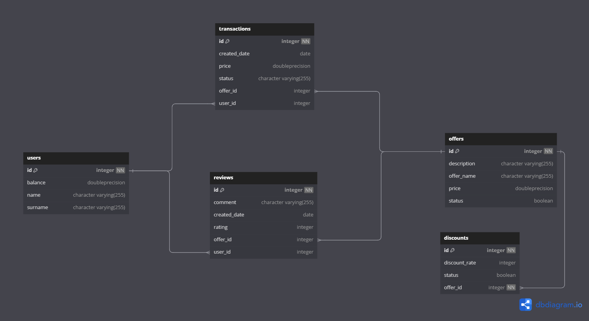
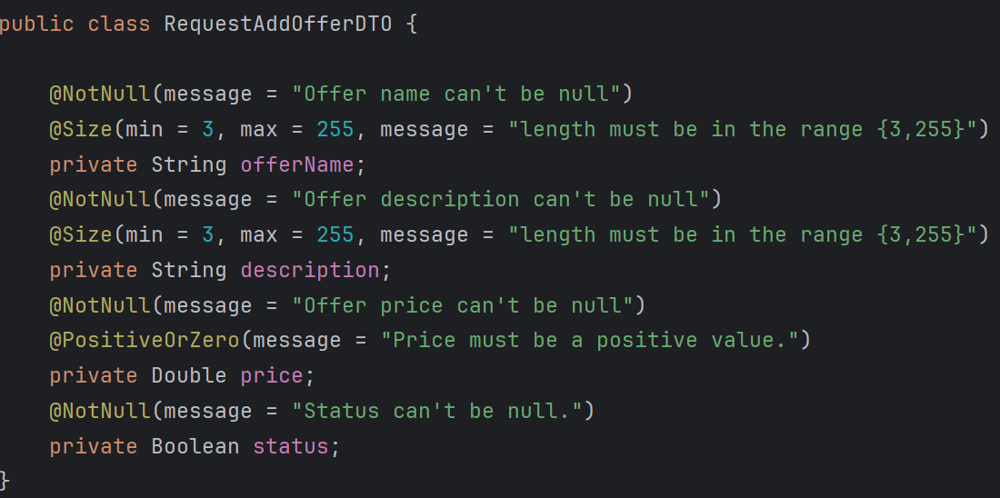
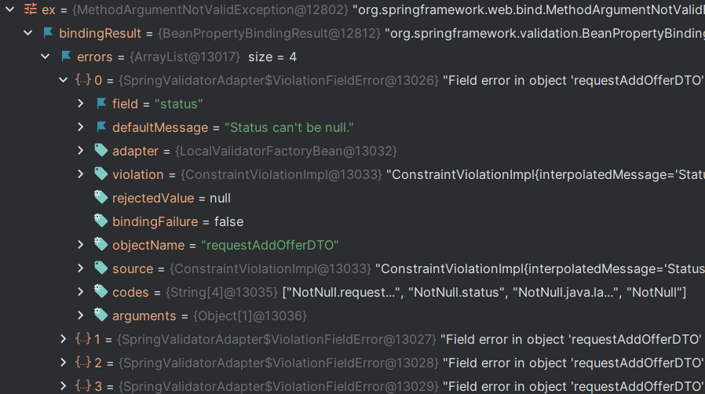
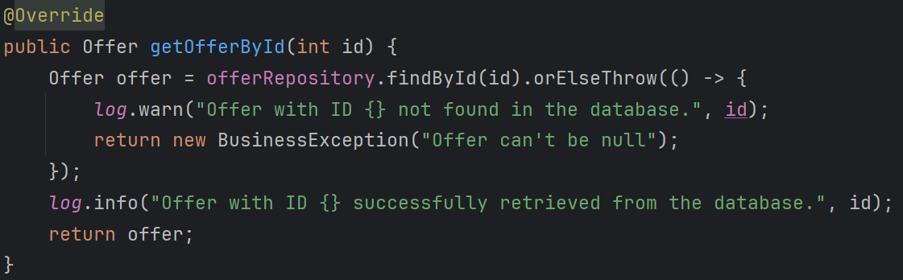
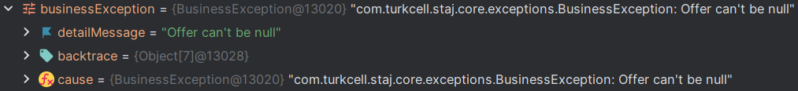

# Proje genel bakış

---

### Uygulama fonksiyonel özellikleri

- **Kullanıcı İşlemleri**

- **Paket İşlemleri**

- **İndirim İşlemleri**

- **Satın Alma ve İade Hareketleri**

- **Ürün Değerlendirme**

# Kullanılan mimari ve teknolojiler

---

#### Mimari
    - Monolithic Architecture

#### Tools
    - Docker
    - Spring Boot
    - PostgreSQL
    - Postman
    - Swagger
    
#### Packages
    - Maven
    - Hazel Cast
    - Spring JPA
    - Spring Validation
    - Lombok
    - Map Struct
    - Mockito
    - JUnit 5
    - JaCoCo
    - Slf4j

# Veri tabanı

---

# Hata yönetimi

#### Validasyon hataları

#### İş katmanı hataları

# Kullanıcı servisi

---

#### Endpoint

#### DTOs

# Paket servisi

---

#### Endpoint

#### DTOs

# İndirim servisi

---

#### Endpoint

#### DTOs

#### Özel sorgular

# İşlem servisi

---

#### Endpoint

#### DTOs

#### Özel sorgular

# Yorum servisi

---

#### Endpoint

#### DTOs

#### Özel sorgular

# Testler

---

